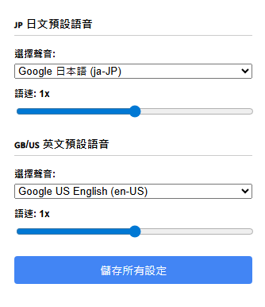

# Smart-TTS: 智慧型雙語朗讀擴充功能

Smart-TTS 是一款為 Chrome 瀏覽器設計的智慧型文字轉語音（Text-to-Speech）擴充功能，專注於提供高品質的日文與英文朗讀體驗。

它能自動偵測您選取文字的語言，並使用您為該語言指定的預設女聲進行朗讀，解決了傳統 TTS 工具在多語言環境下需要手動切換聲音的煩惱。

##  功能特色

* **智慧偵測語言**：自動判斷選取的文字是日文還是英文。
* **雙語獨立設定**：可為日文和英文分別設定偏好的預設聲音和朗讀速度。
* **右鍵即時朗讀**：在任何網頁上選取文字，點擊右鍵即可朗讀。
* **女聲優先**：在聲音選單中，會優先篩選並只顯示女性聲音。
* **自動停止**：當您刷新或離開頁面時，正在進行的朗讀會自動停止，避免背景聲音干擾。
* **簡潔的設定介面**：提供一個直觀的彈出視窗，方便您隨時調整設定。

##  如何安裝

本擴充功能尚未發佈到 Chrome 線上應用程式商店，您可以透過以下步驟手動載入：

1.  **下載專案**：
    * 點擊此頁面右上角的 `Code` 按鈕，然後選擇 `Download ZIP`。
    * 下載後，將 ZIP 檔案解壓縮到您電腦的某個位置（例如桌面）。

2.  **打開 Chrome 擴充功能頁面**：
    * 在 Chrome 網址列輸入 `chrome://extensions` 並按下 Enter。

3.  **啟用開發人員模式**：
    * 在頁面的右上角，找到並**開啟「開發人員模式」**的開關。

4.  **載入未封裝的項目**：
    * 點擊左上角的「載入未封裝的項目」按鈕。
    * 在跳出的檔案選擇器中，選擇您在步驟 1 中解壓縮的**整個專案資料夾**（例如 `Smart-TTS`）。

5.  **完成**：
    * 如果一切順利，您應該會在擴充功能列表中看到 Smart-TTS，並且圖示會出現在瀏覽器的工具列上。

##  如何使用

1.  **初次設定**：
    * 左鍵點擊工具列上的 Smart-TTS 圖示。
    * 在彈出的設定視窗中，**分別為日文和英文選擇您喜歡的預設聲音和語速**。
    * 點擊「儲存所有設定」按鈕。

2.  **開始朗讀**：
    * 在任何網頁上，用滑鼠選取一段日文或英文句子。
    * 在選取的文字上按右鍵。
    * 在右鍵選單中，點擊「朗讀選取的文字」。
    * 擴充功能將會自動使用您對應語言的設定來進行朗讀。

##  授權

本專案採用 [MIT License](Smart-TTS/LICENSE) 進行授權。
